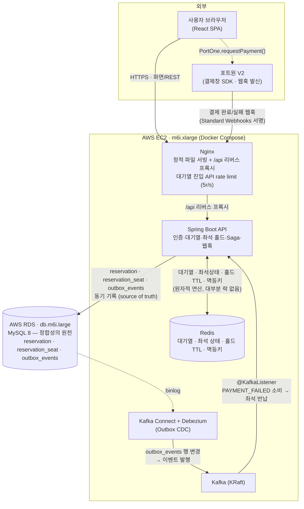
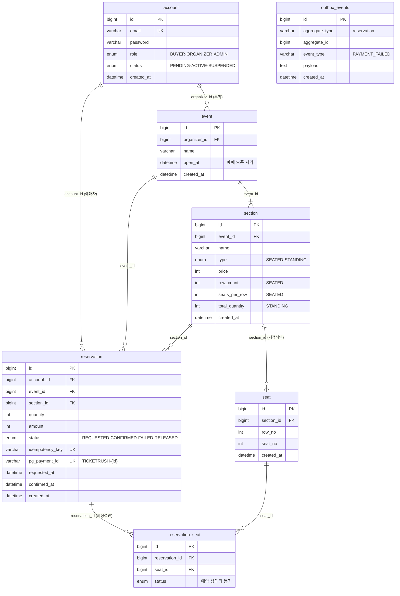

# TicketRush — 다이어그램

포트폴리오/발표용 다이어그램. 근거는 `architecture.md`(요청 흐름), `db-schema.md`(스키마),
`decisions.md`(결정), `redis-design.md`(키 설계).

**정식본은 draw.io 파일이다** (`diagrams/` 폴더, PNG는 `diagrams/export/`):
- `diagrams/01-architecture.drawio` — 시스템 아키텍처
- `diagrams/02-erd.drawio` — ERD

아래 mermaid 블록은 GitHub에서 바로 보이는 빠른 참고용이며, 세부 표현/레이아웃은 draw.io 파일이 우선한다.
처리 흐름도(시퀀스)는 일정상 만들지 않기로 함(2026-09-07).

---

## 1. 시스템 아키텍처 (배포 구성)

`decisions.md` 10번 — EKS/ElastiCache/MSK/CloudWatch를 도입하지 않고 **EC2 한 대 + RDS**로 배포.
"관리형 서비스를 써봤다"보다 분산락 벤치마크처럼 근거 있는 선택이 포트폴리오에 더 강하다는 판단.
한계 테스트(`test-results.md` 5-2)에서 이 co-location 구조의 병목(Redis 자원 공유)을 실측·진단했다.

**핵심 포인트**
- 좌석 동시성 제어는 대부분 **Redis 원자 연산**으로 처리 → DB에는 결제 요청까지 도달한 소수만 닿음 (`decisions.md` 7번)
- 결제확정 DB 기록 + 이벤트 발행의 원자성은 **Outbox 패턴 + Debezium CDC** (`decisions.md` 6번) — 애플리케이션이 Kafka로 직접 publish하지 않음
- 포트원 웹훅이 **결제 확정의 단일 트리거** — SDK 콜백만 믿지 않음(창 닫힘·네트워크 끊김 대비)

---

## 2. ERD

`db-schema.md` 기준. `SEAT_HELD`는 Redis 전용 상태라 `reservation` 행은 `PAYMENT_REQUESTED`부터 생긴다.
`reservation_seat`는 그룹 좌석(최대 2매)을 표현하기 위한 자식 테이블.

> `outbox_events`는 다른 테이블과 FK로 연결되지 않는다 — Debezium이 binlog로만 읽고, `aggregate_id`로 논리적 참조만 한다(`decisions.md` 6번).
> `reservation_seat.uq_active_seat`(같은 좌석에 진행 중 행 1개만)는 MySQL 생성 컬럼 제약을 `ddl-auto`로 못 만들어 **애플리케이션 레벨 검증**(`existsBySeatIdAndStatusIn`)으로 대체(`db-schema.md` 6번).
> 인덱스·제약 설계 근거(`idx_account_event_status` 누적 2매 제한, rebuild 조회용 인덱스 등)는 `db-schema.md` 참고 — ERD 다이어그램에는 컬럼만 표기한다.
