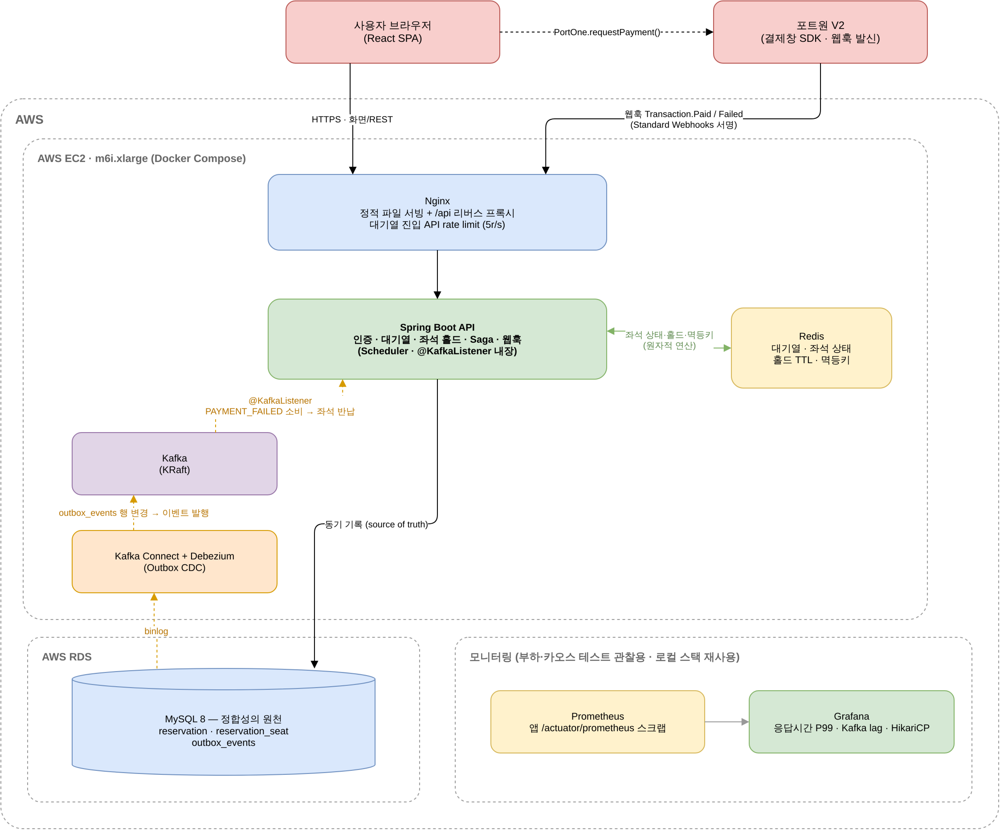
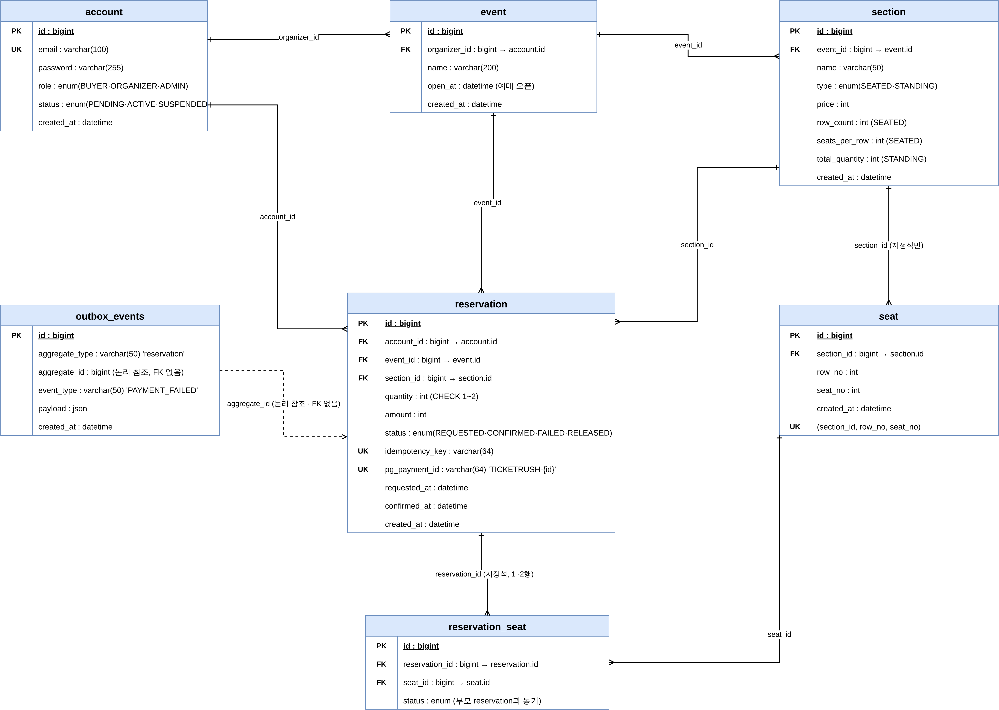
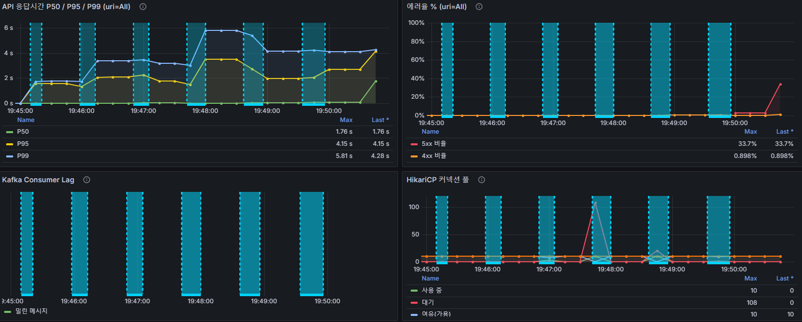
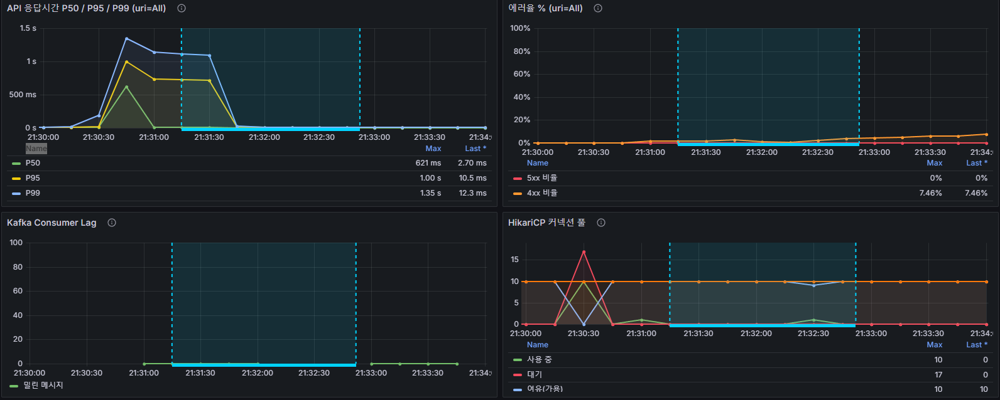

# 🎫 TicketRush

> 스탠딩·지정석이 혼합된 콘서트 좌석 예매 시스템.
> 오픈 순간의 트래픽 폭주와 Redis·Kafka 장애 상황에서도 **오버셀(초과 판매) 0**을 보장하고,
> 그것을 부하 테스트·카오스 테스트로 **직접 측정해 증명**하는 것을 목표로 한 프로젝트입니다.


**기간** 2026.08 ~ 2026.09 (30일) · **인원** 1인 · **저장소** https://github.com/2000JCH/TicketRush

🔗 시연 영상: *(링크 추가 예정)* · 📄 포트폴리오: [TicketRush 부하/장애테스트_요약](https://app.notion.com/p/3d78d16f89fd80bea748fbbb82f8173f)

---

## 목차

1. [개요](#1-개요)
2. [핵심 기능](#2-핵심-기능)
3. [시스템 아키텍처](#3-시스템-아키텍처)
4. [ERD](#4-erd)
5. [기술 스택](#5-기술-스택)
6. [기술적 의사결정 & 트러블슈팅](#6-기술적-의사결정--트러블슈팅)
7. [테스트 결과](#7-테스트-결과)
8. [실행 방법](#8-실행-방법)
9. [프로젝트 구조](#9-프로젝트-구조)

---

## 1. 개요

실제 티켓팅 사이트처럼 특정 오픈 시각에 트래픽이 몰리는 **"선착순 오픈(Rush)"** 상황을 전제로 합니다.
이 프로젝트가 풀려는 문제는 다음 3가지입니다.

- 동시에 수천 명이 같은 좌석·수량을 두고 경쟁할 때 **오버셀이 발생하지 않도록** 보장
- 좌석 선택 → 홀드 → 결제 → 확정 흐름에서 일부 단계가 실패·타임아웃돼도 **좌석 상태가 항상 정확히 복원**
- Redis·Kafka가 실제로 장애를 일으켜도(카오스 테스트) **정합성이 깨지지 않는 것**

즉 "빠른가"보다 **"폭주·장애 상황에서 버티는가"를 직접 만들고 실측으로 증명**하는 데 초점을 뒀습니다.
설계 문서 작성 → 구현 → 부하/카오스 테스트 → AWS 배포·재측정까지 전 과정을 1인으로 진행했으며,
모든 아키텍처 결정은 `.claude/docs/decisions.md`에 근거와 함께 기록했습니다.

---

## 2. 핵심 기능

| 도메인 | 기능 |
|---|---|
| **대기열** | Redis Sorted Set 기반 선착순 대기열. 순번을 폴링으로 확인하다 차례가 되면 스케줄러가 입장 토큰(TTL) 발급 |
| **좌석 홀드** | 자원 유형별 3분기 — ① 지정석 단일: `HSETNX` 원자 연산(락 없음) ② 지정석 그룹(≤2매): Redisson 분산락으로 전부 성공 또는 전부 롤백 ③ 스탠딩: `HINCRBY` 수량 차감 |
| **홀드 만료** | 만료 시각 정렬 집합(`hold_schedule`) + 주기 스케줄러로 자동 반납 (Redis Keyspace Notification 원안에서 재설계 — [6번](#6-기술적-의사결정--트러블슈팅) 참고) |
| **결제 Saga** | Choreography 방식. 결제 실패 시 `outbox_events` → Debezium CDC → Kafka → Consumer가 좌석 자동 반납. 중앙 조율자 없음 |
| **결제 연동** | 포트원(PortOne) V2 — 토스페이먼츠(카드) / 카카오페이(간편결제). 웹훅 서명 검증(Standard Webhooks), DB 상태 조회로 멱등 보장 |
| **장애 복구** | Redis 재시작으로 좌석 상태가 유실되면 요청 경로에서 감지 → DB 기준으로 재구성(rebuild), 그 사이 요청은 매진과 구분되는 `503` |
| **인증** | JWT(Access 단기 + Refresh 회전). Refresh Token은 httpOnly Cookie + Redis 저장으로 즉시 무효화 가능 |
| **프론트엔드** | 예매 골든 패스 · 내 예약/내 정보 · 관리자 콘솔(주최자 승인·회원 관리·콘서트별 매출 현황) · 주최자 공연 등록 |

---

## 3. 시스템 아키텍처



- **AWS EC2 1대 + Docker Compose**(Nginx · Spring Boot · Redis · Kafka · Kafka Connect/Debezium) **+ RDS(MySQL)**
- EKS·ElastiCache·MSK·CloudWatch는 **의도적으로 도입하지 않음** — 1인·30일 규모에서는 "관리형 서비스를 써봤다"보다
  분산락 벤치마크처럼 **근거를 갖고 내린 선택**이 포트폴리오에 더 설득력 있다고 판단했고,
  이 co-location 구조의 한계(Redis 자원 공유 병목)까지 [테스트로 실측·진단](#7-테스트-결과)했습니다.
- **좌석 동시성 제어**는 대부분 Redis 원자 연산으로 처리 → DB에는 결제 요청까지 도달한 소수만 닿습니다.
- **DB 트랜잭션과 이벤트 발행의 원자성**은 애플리케이션이 Kafka로 직접 발행하지 않고 **Outbox 패턴 + Debezium CDC**로 확보합니다.
- **포트원 웹훅이 결제 확정의 단일 트리거** — SDK 콜백만 믿지 않습니다(창 닫힘·네트워크 끊김 대비).

---

## 4. ERD



- 테이블 7개. 상세 스키마·인덱스 근거는 [`.claude/docs/db-schema.md`](.claude/docs/db-schema.md)
- `SEAT_HELD`는 **DB에 저장하지 않습니다** — 홀드는 TTL 5~10분짜리 Redis 전용 임시 상태이고,
  `reservation` 행 자체가 결제 요청(`PAYMENT_REQUESTED`) 시점부터 생성됩니다.
- 스탠딩 예약은 `reservation_seat` 행이 없습니다(`quantity`만으로 수량 표현).
- `outbox_events`는 다른 테이블과 FK로 연결되지 않습니다 — Debezium이 binlog로만 읽고 `aggregate_id`로 논리 참조만 합니다.

---

## 5. 기술 스택

### Backend

| 기술 | 역할 / 선택 이유 |
|---|---|
| **Java 21 · Spring Boot 4.1 · Gradle** | 최신 스택 학습 목적. Jackson 3 전환(`tools.jackson.*`), Kafka auto-config 분리 등 메이저 버전 전환 이슈를 직접 겪음 |
| **Spring Data JPA / Hibernate** | 엔티티에서 테이블 자동 생성(`ddl-auto=update`). Flyway는 도입하지 않고 생성 컬럼·CHECK 제약은 애플리케이션 레벨 검증으로 대체 |
| **Spring Security + JJWT** | JWT 인증(Access 단기 + Refresh 회전). 스케일아웃 시 세션 공유 불필요. Refresh Token은 httpOnly Cookie(XSS 완화) + Redis 저장(즉시 무효화). JSON 처리기는 Jackson 3 호환 문제로 `jjwt-gson` |
| **Spring Data Redis + Redisson 4.7** | Redis 접근 + 그룹 홀드용 분산락(RLock). Redisson은 core만 추가하고 `RedissonClient` 직접 구성(Jackson 2/3 충돌 회피) |
| **Spring for Apache Kafka** | `@KafkaListener`로 `PAYMENT_FAILED` 이벤트 소비 → 좌석 반납. Boot 4는 `spring-boot-starter-kafka` 필수([6번 ③](#6-기술적-의사결정--트러블슈팅)) |
| **Spring Boot Actuator + Micrometer** | `/actuator/prometheus` 하나로 API 응답시간·HikariCP 커넥션 풀·Kafka Consumer lag를 자동 노출(별도 exporter 불필요) |

### Data & Messaging

| 기술 | 역할 / 선택 이유 |
|---|---|
| **MySQL 8** | 정합성의 원천(`reservation`·`reservation_seat`·`outbox_events`). 결제 확정은 반드시 여기 동기 기록. 좌석 대량 생성만 `JdbcTemplate` batch |
| **Redis 7.2** | 대기열(Sorted Set)·좌석 상태(Hash)·홀드 TTL·멱등키(`SETNX`). 싱글 스레드 원자성으로 좌석 1개·스탠딩 재고는 **락 없이** 오버셀 차단. AOF/RDB 비활성(`HELD`는 휘발돼도 되는 임시 상태) |
| **Apache Kafka (KRaft)** | 결제 확정 "이후" 후속 작업을 사용자 응답과 분리. 좌석 동시성 제어 자체는 Kafka가 아니라 Redis가 담당 |
| **Debezium (Kafka Connect)** | MySQL binlog CDC → `outbox_events` 변경을 Kafka 토픽으로 발행. 애플리케이션이 Kafka로 직접 publish하지 않음(Outbox 패턴) |

### Infra & Deploy

| 기술 | 역할 / 선택 이유 |
|---|---|
| **Docker / Docker Compose** | 로컬 개발 인프라 + AWS 배포 단위. 앱도 `Dockerfile`로 컨테이너화(리허설·배포는 컨테이너, 평소 개발은 `bootRun`) |
| **AWS EC2 (`m6i.xlarge`, Amazon Linux 2023)** | 앱 + Redis + Kafka + Kafka Connect + Nginx를 단일 인스턴스에 co-location. EKS·ElastiCache·MSK는 [의도적으로 미도입](#3-시스템-아키텍처) |
| **AWS RDS (MySQL 8, `db.m6i.large`)** | 관리형 DB. binlog 파라미터 그룹(`binlog_format=ROW`)으로 Debezium 연동 |
| **Nginx** | 대기열 진입 API Rate Limiter(5r/s) + 프론트 정적 파일 서빙 + `/api` 리버스 프록시. 순서 보장은 Redis 대기열이 담당 |

### Frontend

| 기술 | 역할 / 선택 이유 |
|---|---|
| **React 19 · Vite · TypeScript** | 데모 프론트엔드. Access Token은 메모리에만, 새로고침 시 `/auth/refresh`로 세션 조용히 복구, 만료 시 자동 재발급 후 원요청 1회 재시도 |
| **React Router 7** | SPA 라우팅. `ProtectedRoute`의 `adminOnly`/`organizerOnly` 프롭으로 역할별 화면 분리 |
| **@portone/browser-sdk** | 포트원 V2 결제창 호출(`PortOne.requestPayment()`). 카드=토스페이먼츠 / 카카오페이=간편결제 |

### Test & Observability

| 기술 | 역할 / 선택 이유 |
|---|---|
| **Gatling** | 부하 테스트 + 카오스 중 부하 발생을 하나의 시나리오(`GoldenPathSimulation`)로 통일. 별도 Controller/Agent 서버 없이 시나리오 코드만으로 실행 |
| **Prometheus + Grafana** | 부하/카오스 테스트 관찰(로컬·측정 세션 한정). 4패널 대시보드: 응답시간 P50/95/99 · 상태코드별 요청/에러율 · Kafka lag · HikariCP |
| **JUnit 5** | Saga 상태 전이(확정/실패), 그룹 홀드 동시성(오버셀 0) 등 |
| **포트원(PortOne) V2** | 결제 연동. V2는 PG사와 무관하게 웹훅 페이로드·서명 검증(Standard Webhooks)을 통일 — 채널이 여러 개여도 웹훅 로직을 나눌 필요 없음 |

---

## 6. 기술적 의사결정 & 트러블슈팅

> 각 결정의 근거·대안 비교는 [`.claude/docs/decisions.md`](.claude/docs/decisions.md),
> 측정 수치·재현 과정은 [`.claude/docs/test-results.md`](.claude/docs/test-results.md)에 있습니다.

### ① 분산락: Redisson RLock vs DB 비관적 락 — 직접 구현해 실측 비교

두 방식을 `GroupHoldLockStrategy` 인터페이스로 추상화해 모두 구현하고, 300명 완전 동시 / 좌석 4개로 벤치마크했습니다.
**처리량·P99는 사실상 동등**(우리 홀드 액션이 `HSETNX` 한 번으로 매우 짧아 락 점유 시간이 무의미). 유일한 실질 차이는
DB 락이 `REQUIRES_NEW` 트랜잭션마다 HikariCP 커넥션을 물어 **pending이 147까지** 쌓인 것(Redisson은 0).
→ **Redisson 채택.** "지금 느려서"가 아니라 **확장 시 먼저 무너지는 실패 모드(커넥션 고갈 → HikariCP 타임아웃 절벽)가 있어서**입니다.

### ② Redis 장애 복구 로직 — 설계엔 있고 코드엔 없던 것을 카오스 테스트가 잡아냄

2주차 설계 문서에 "Redis 재시작 시 DB 기준으로 좌석 점유 상태를 재구성한다"고 상세히 적어뒀는데,
3주차 카오스 테스트를 준비하며 확인해보니 **그 로직이 코드 어디에도 없었습니다.**
직접 재현: 좌석을 `PAYMENT_REQUESTED` 상태로 만든 뒤 Redis 키를 지우자 그 좌석이 `AVAILABLE`로 보였습니다(재판매 가능 상태).
→ `SeatStatusRebuildService` 구현. 요청 경로에서 유실을 감지 → 짧은 TTL 락으로 중복 재구성 방지 →
락을 못 잡은 요청은 매진과 구분되는 `503`으로 즉시 실패(부분 상태를 아무도 안 읽도록).

### ③ Kafka 파이프라인이 "정상으로 보이는 채로" 아무 일도 안 하고 있던 문제

Outbox → Debezium → Kafka → `@KafkaListener` 배관을 다 잇고 결제 실패 이벤트를 흘렸는데 DB 상태가 끝까지 안 바뀌었습니다.
앱은 8초 만에 에러 없이 기동했지만 Kafka 관련 로그가 **한 줄도 없었고**, 소비자 그룹 자체가 존재하지 않았습니다.
원인: **Spring Boot 4부터 `KafkaAutoConfiguration`이 `spring-boot-autoconfigure`에서 빠져 별도 스타터로 분리**됨.
`spring-kafka`만 추가하면 에러 없이 `@KafkaListener`가 조용히 미등록되는 실패였습니다.
jar 안의 `AutoConfiguration.imports`를 직접 열어 원인을 1차 자료로 확인 후 `spring-boot-starter-kafka`로 교체.

### ④ 한계 테스트: "vCPU를 2배로 늘리면 한계도 오를 것"이라는 예측이 틀린 사례

AWS 배포 전, EC2/RDS 스펙만큼 리소스를 제한한 로컬 리허설 스택으로 한계 테스트를 먼저 돌렸습니다.
로컬(2 vCPU)에서는 **HikariCP 커넥션 풀**이 1순위 병목이었고 — `GET /seats`가 등록 후 안 바뀌는 좌석 배치도를
매번 DB에서 다시 읽고 있어 좌석 배치도 Redis 캐싱(`SeatCatalogRepository`)으로 P95를 32~46% 개선했습니다.
그런데 **AWS(4 vCPU)에서도 절벽이 나타났고**, 원인은 HikariCP가 아니라
**Redis 명령 타임아웃**이었습니다 — Redis를 app·Kafka와 같은 EC2 한 대에서 CPU를 나눠 쓰는 구조([ElastiCache 미도입](#3-시스템-아키텍처)의 결과)에서
부하가 몰리면 Redis가 밀려 2초 타임아웃(`spring.data.redis.timeout`)에 걸립니다. 예측이 왜 틀렸는지 **원인까지 특정**해 결과로 남겼습니다.
절벽의 정확한 위치(최초 측정 250~300명대 → 인스턴스를 새로 띄워 재검증하니 450~500명대)는 AWS 인스턴스 배정마다 달랐지만,
**같은 로그(`RedisCommandTimeoutException`)로 원인이 동일함을 두 번 다 확인**했습니다 — 클라우드 환경에서는 병목의 정체와
절대 임계값을 구분해서 봐야 한다는 것도 실측으로 배운 지점입니다.

### ⑤ 좌석 대량 생성 — JPA 배치 설정이 통하지 않는 조건

공연 하나 등록 시 좌석이 수천~수만 행 생성됩니다. `hibernate.jdbc.batch_size`를 켜도 전혀 빨라지지 않았는데,
`seat.id`가 `AUTO_INCREMENT`(JPA `IDENTITY` 전략)라 Hibernate가 INSERT마다 생성 ID를 즉시 받아와야 해서 **배치를 스스로 포기**하기 때문입니다.
→ 좌석 삽입 경로만 `JdbcTemplate.batchUpdate` + JDBC URL `rewriteBatchedStatements=true`(둘은 반드시 짝).
MySQL `Com_insert` 상태값을 요청 전후로 비교해 **실제 실행된 INSERT 문 개수**로 검증.

---

## 7. 테스트 결과

> 측정 환경: AWS EC2 `m6i.xlarge`(4 vCPU / 16 GiB) + RDS `db.m6i.large`. 2026-09-06 최초 측정 → 2026-09-10 동일 방법론으로 재검증(인스턴스를 새로 띄워 재측정 — 병목의 정체는 동일하게 재현됐으나 정확한 절벽 위치는 AWS 인스턴스 배정에 따라 달라질 수 있음을 실측으로 확인).
> 상세 수치·과정은 [`.claude/docs/test-results.md`](.claude/docs/test-results.md), 계획·근거는 [`.claude/docs/test-plan.md`](.claude/docs/test-plan.md).

### 부하 테스트 (Gatling)

| 지표 | 목표 | 실측 | 판정 |
|---|---|---|---|
| 동시 300명 좌석 홀드 P95 | < 2,000ms | **875ms** | ✅ |
| 오버셀 | 0건 | **0건** (전 측정 세션 누적) | ✅ |
| 에러율 (경합 제외) | < 1% | 0% (N=300 기준) | ✅ |
| 한계 동시 사용자 | (참고, SLO 아님) | ~450~500명 (그 이상은 Redis 명령 타임아웃으로 붕괴 — 원인까지 진단) | 참고 |

전 구간에서 **느리게/에러로 무너지되 틀리게 처리하지는 않았습니다**(오버셀 0).



### 카오스 테스트 (장애 주입)

| 시나리오 | 결과 |
|---|---|
| **A-1 — Redis 97초 완전 다운 → 복구** | 오버셀 **0** · `seat_status` 재구성 완료까지 **18초** · 재구성 중 요청은 `503`으로 즉시 실패(부분 상태 미노출) |
| **A-2 — Kafka 브로커 97초 완전 다운 → 복구** | 장애 중 결제 요청·웹훅 5xx **0건**(2,233 + 207건 전부 성공) · 이벤트 유실 **0**(outbox 207 = 좌석 반납 207) · Consumer lag 자동 복구 |

**A-2 핵심**: 응답시간·에러율 그래프만 봐서는 **언제 Kafka가 죽어 있었는지 알 수 없습니다** —
결제 확정/실패가 DB 트랜잭션 + outbox INSERT라 Kafka와 동기적으로 얽히지 않기 때문입니다(Outbox 패턴이 Kafka를 critical path에서 제거).



---

## 8. 실행 방법

### 사전 준비

- Docker / Docker Compose
- JDK 21
- Node.js 20.19+ 또는 22.12+ (Vite 8)

### 1) 인프라 기동 (프로젝트 루트)

```bash
docker compose up -d          # MySQL · Redis · Kafka(KRaft) · Kafka Connect(Debezium) · Nginx · Prometheus · Grafana
```

### 2) 백엔드

```bash
cd ticketrush-backend
# .env 파일 생성 (아래 키 필요)
gradlew.bat bootRun           # POSIX: ./gradlew bootRun
```

`ticketrush-backend/.env` (gitignore 대상 — 새 환경에서 직접 생성):

```
# 필수
JWT_SECRET=                   # HS256 이상, 32바이트 이상
ADMIN_EMAIL=                  # 기동 시 자동 생성되는 ADMIN 계정
ADMIN_PASSWORD=
PORTONE_STORE_ID=             # GET /api/v1/payments/config 로 프론트에 전달 (공개 식별자)
PORTONE_CHANNEL_KEY_TOSS=     # 카드
PORTONE_CHANNEL_KEY_KAKAO=    # 간편결제
PORTONE_WEBHOOK_SECRET=       # whsec_ 접두사 + base64. 없으면 웹훅을 전부 거절

# 선택 (기본값 있음)
JWT_ACCESS_EXPIRATION=1800000     # ms, 기본 30분
JWT_REFRESH_EXPIRATION=604800000  # ms, 기본 7일
REFRESH_COOKIE_SECURE=false       # 로컬(http)은 false
FRONTEND_ORIGIN=http://localhost:5173
PORTONE_API_SECRET=               # 서버 대 서버 결제 재검증용 (현재 미사용)
```

### 3) Debezium Outbox 커넥터 등록

```powershell
scripts/register-outbox-connector.ps1   # 컨테이너 재기동 시마다 재등록 필요
```

### 4) 프론트엔드

```bash
cd ticketrush-frontend
npm install
npm run dev                   # http://localhost:5173
```

### 테스트

```bash
cd ticketrush-backend
gradlew.bat test
```

> 로컬에서는 포트원 웹훅이 도달하지 못해 결제창 호출 이후 "처리 중"에서 멈춥니다.
> 결제 확정·웹훅 서명 검증은 AWS 배포 환경에서 실측 통과했습니다.

---

## 9. 프로젝트 구조

```
TicketRush/
├── ticketrush-backend/          # Spring Boot 4.1 / Java 21 / Gradle
│   └── src/main/java/com/ticketrush/ticketrush/
│       ├── domain/{account,event,queue,seat,reservation}/   # 도메인별 controller/dto/entity/repository/service
│       └── global/{config,entity,exception,jwt}/            # 공통
├── ticketrush-frontend/         # React + Vite + TypeScript
├── docker-compose.yml           # 로컬 개발 인프라 (+ .rehearsal / .capacity / .aws 오버레이)
├── nginx/ · prometheus/ · grafana/
├── scripts/                     # 커넥터 등록 · 부하/카오스 테스트 스크립트
└── .claude/docs/                # 설계 문서
    ├── decisions.md             # 기술 의사결정 로그 (근거 포함)
    ├── architecture.md · db-schema.md · redis-design.md · api-design.md
    ├── test-plan.md · test-results.md   # 부하/카오스 테스트 계획·실측
    ├── aws-spec.md · aws-deploy.md      # AWS 스펙 산정·배포 런북
    └── diagrams/                # 아키텍처 · ERD (draw.io)
```
