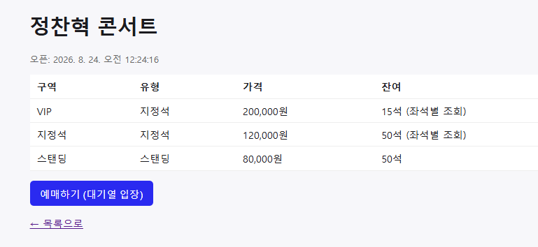
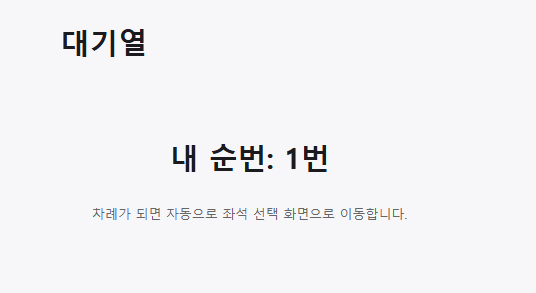
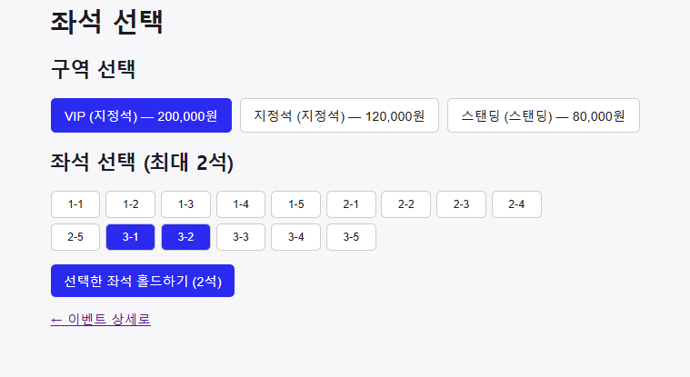
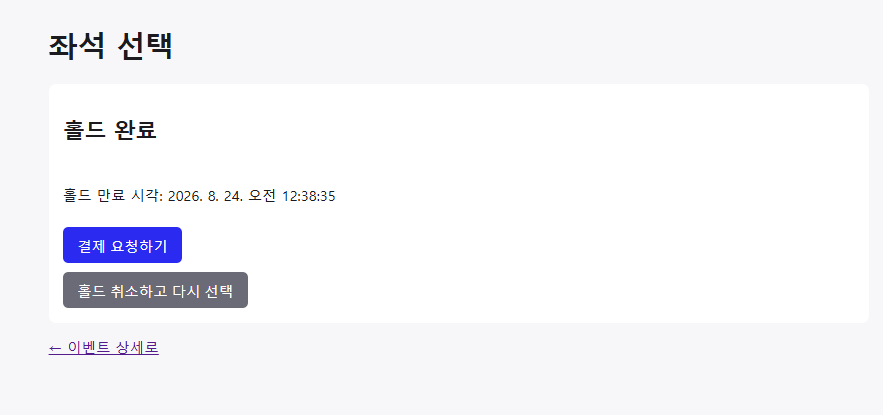

# TicketRush 중간 보고서

---

## 1. 프로젝트 소개 및 해결하려는 문제

**TicketRush**는 스탠딩/지정석이 혼합된 콘서트 좌석 예매 시스템입니다. 실제 티켓팅 사이트처럼 특정 오픈 시각에 트래픽이 폭주하는 "선착순 오픈(Rush)" 상황을 전제로 하며, 이 프로젝트가 풀려는 핵심 문제는 다음과 같습니다.

- 동시에 수천 명이 같은 좌석/수량을 두고 경쟁할 때 **오버셀(초과 판매)이 발생하지 않도록** 보장하는 것
- 좌석 선택 → 홀드 → 결제 → 확정까지 이어지는 흐름에서, 일부 단계가 실패하거나 타임아웃되어도(결제 실패, TTL 만료 등) **좌석 상태가 항상 정확히 되돌아가는 것**
- Redis/Kafka 같은 인프라가 실제로 장애를 일으켜도(카오스 테스트) 정합성이 깨지지 않는 것

즉 "빠른가"뿐 아니라 "폭주·장애 상황에서도 버틸 수 있는가"를 직접 만들고 실측으로 증명하는 것이 목표입니다.

- 기간: 2026-08-10 ~ 2026-09-09 (30일, 1인 개발)

---

## 2. 현재까지 구현·진행한 내용

### 1주차 (완료)

- **회원가입/로그인**: 이메일·비밀번호로 가입하고 로그인하면 접속을 유지할 수 있는 토큰을 발급받습니다. 로그인 상태를 오래 유지하기 위한 재발급 토큰도 안전하게(httpOnly Cookie + Redis 저장, 재발급마다 값 교체) 구현했습니다
- **주최자(ORGANIZER) 가입 승인제**: 아무나 바로 공연을 등록하지 못하도록, 주최자로 가입하면 관리자(ADMIN)가 승인해야만 로그인할 수 있게 했습니다
- **공연(이벤트) 등록/관리**: 주최자가 공연 정보와 구역·좌석을 등록·수정(전체 교체)·삭제·조회할 수 있습니다. 좌석이 최대 7만 석까지 나올 수 있어 대량 생성도 빠르게 처리되도록 만들었습니다(`JdbcTemplate` batch)
- **대기열(줄서기)**: 예매 오픈 시 한꺼번에 몰리는 사용자를 도착 순서대로 세워두고, 자기 순번을 폴링으로 확인하다가 차례가 되면 자동으로 입장 토큰을 받습니다(Redis Sorted Set 기반 대기열 + 주기적으로 앞순번을 통과시키는 스케줄러)
- **결제 연동 사전 점검**: 실제 결제대행사(포트원)와 연결이 되는지 미리 확인했고, 결제수단은 카드(토스페이먼츠)·카카오페이 2가지로 정했습니다

### 2주차 (완료)

- **좌석 선택(홀드)**: 좌석을 고르면 남이 동시에 못 고르도록 잠그는 기능입니다. 여러 명이 같은 좌석을 동시에 눌러도 Redis 명령의 원자성 덕분에 딱 한 명만 성공합니다
- **자동 좌석 반납**: 좌석만 잡아두고 결제를 안 하면 일정 시간 뒤 자동으로 풀려서 다른 사람이 다시 고를 수 있게 됩니다(설계 문서의 원안이던 Redis Keyspace Notification 대신, 만료 시각순 목록 + 주기적 스케줄러 방식으로 구현 단계에서 재설계 — 상세 내용은 5번 참고)
- **예약→결제 상태 흐름(Saga)**: 좌석 찜 → 결제 요청 → 결제 성공 시 확정, 실패 시 좌석을 자동으로 되돌리는 상태 흐름을 만들었습니다. 아직 실제 PG 호출은 붙이지 않았고 상태 전이 로직만 이 프로젝트 첫 자동 테스트(JUnit 8건)로 검증한 단계이며, 실제 결제 연동은 3주차에 이어붙일 예정입니다
- **2좌석 동시 선택(그룹 홀드) 성능 비교 준비**: 좌석 2개를 한 번에 묶어서 잡는 기능에 서로 다른 두 가지 잠금 방식(Redisson 분산락 / DB 비관적 락)을 각각 구현해뒀습니다. 동시성 테스트(8개 요청 동시 시도)로 둘 다 초과 판매 없이 안전하게 동작하는 것까지는 확인했고, **둘 중 어느 방식을 최종 채택할지는 아직 정하지 않아** 3주차 부하테스트에서 실측 비교 후 정합니다

---

## 3. 현재 결과물

데모용 프론트엔드(React/Vite)로 실제 화면을 캡처했고, 화면이 없는 부분(자동 테스트/DB 실측)은 터미널 캡처로 대체합니다.

### 대기열 진입 → 순번 폴링 → 입장 토큰 발급





### 좌석 조회 → 홀드




홀드 해제 및 TTL 만료 후 자동 반납은 2주차에 Node 스크립트 기반 자동 테스트로 이미 검증했습니다(`progress.md` 2026-08-19 기록) — 명시적 해제 시 스케줄까지 함께 지워지는지, TTL 경과 후 자동으로 `AVAILABLE`로 돌아오는지 모두 확인했습니다.

### 그룹 좌석 홀드 동시성 테스트 (오버셀 0건)

```
$ gradlew.bat test --tests "*GroupHold*"

SeatServiceGroupHoldTest (Redisson RLock)     — 5개 테스트, 0 실패 (1.924초)
  ✓ groupHold_bothSeatsSucceed()                      ← 좌석 2개를 그룹으로 한 번에 요청하면 둘 다 정상적으로 잡히는지
  ✓ groupHold_duplicateSeatIds_rejected()              ← 같은 좌석을 두 번 중복으로 요청하면 거절되는지
  ✓ groupHold_moreThanTwoSeats_rejected()              ← 좌석 3개 이상 요청하면 거절되는지 (최대 2개 정책)
  ✓ groupHold_oneSeatAlreadyHeld_rollsBackTheOther()   ← 둘 중 하나가 이미 다른 사람 좌석이면 나머지도 자동으로 취소되는지
  ✓ groupHold_concurrentSamePair_onlyOneSucceeds()     ← 8명이 동시에 같은 좌석 2개를 노려도 딱 1명만 성공하는지 (오버셀 0건 확인)

SeatServiceGroupHoldDbLockTest (DB 비관적 락)  — 3개 테스트, 0 실패 (11.16초)
  ✓ groupHold_bothSeatsSucceed()                      ← 좌석 2개를 그룹으로 한 번에 요청하면 둘 다 정상적으로 잡히는지
  ✓ groupHold_oneSeatAlreadyHeld_rollsBackTheOther()   ← 둘 중 하나가 이미 다른 사람 좌석이면 나머지도 자동으로 취소되는지
  ✓ groupHold_concurrentSamePair_onlyOneSucceeds()     ← 동일 시나리오(8명 동시 경쟁), 오버셀 0건 확인

BUILD SUCCESSFUL
```

### 이벤트 등록 시 좌석 대량 생성 실측

50,000석(100행 × 500석) 규모 이벤트를 새로 등록해 재현 측정했습니다.

```
Com_insert (등록 전): 83
Com_insert (등록 후): 135
→ INSERT 문 52개로 50,000개 좌석 생성 (이벤트 1 + 구역 1 + 좌석 50배치)
소요 시간: 1,361ms (약 1.4초)
```

2주차에 처음 측정했던 값(INSERT 문 53개, 1,673ms)과 거의 동일한 결과로, 재현성까지 확인했습니다.

---

## 4. 사용 기술 및 주요 기술 선택 이유

| 기술 | 선택 이유 |
|---|---|
| Spring Boot 4.1.0 / Java 21 | 최신 스택 학습 목적 + Jackson 3 전환 등 실전 이슈를 직접 부딪혀보기 위함입니다 |
| JWT (Access 단기만료 + Refresh) | 서버를 여러 대로 늘려도(스케일아웃) 세션을 서버끼리 공유할 필요가 없도록(무상태) 하기 위함입니다. Refresh Token은 httpOnly Cookie로 전달해 XSS 위험을 줄이고, Redis에 저장해 로그아웃/탈취 시 즉시 무효화할 수 있게 했습니다 |
| Redis (원자 연산 기반 좌석 제어) | Redis는 싱글 스레드라 `HSETNX`(좌석 하나 잡기)·`HINCRBY`(스탠딩 재고 증감) 같은 단일 명령 자체가 이미 원자적입니다. 그래서 좌석 하나·스탠딩 재고는 별도 락 없이도 오버셀을 막을 수 있고, 락은 여러 좌석을 한 번에 묶는(그룹 홀드) 경우에만 필요해 적용 범위를 최소화했습니다 |
| Redisson RLock vs DB 비관적 락 | 그룹 홀드 하나만을 위해 분산락 기술을 미리 하나로 정하기보다, 두 방식을 실제로 구현해 처리량·지연·에러율을 직접 비교(3주차)하고 근거를 갖고 채택하기 위함입니다 |
| Gatling (부하테스트, 3주차 예정) | nGrinder처럼 별도 Controller/Agent 서버를 띄울 필요 없이, 로컬에서 시나리오 코드만 작성하면 바로 실행하고 HTML 리포트까지 받아볼 수 있어 1인 프로젝트에 설치·운영 부담이 적습니다 |
| Pumba (카오스/장애 주입 테스트, 3주차 예정) | Docker 컨테이너를 직접 대상으로 하는 도구라 지금 쓰는 docker-compose(MySQL/Redis/Kafka)에 코드 수정 없이 그대로 적용할 수 있습니다. 컨테이너 강제 종료뿐 아니라 네트워크 지연·패킷 유실 같은 시나리오도 다룰 수 있어, 단순 `docker stop`보다 표현력이 넓고 Toxiproxy처럼 애플리케이션 연결 설정을 바꿀 필요도 없습니다 |
| Kafka (KRaft) + Outbox 패턴 (3주차 구현 예정) | DB 트랜잭션과 메시지 발행을 하나로 묶을 수 없는 문제를 `outbox_events` 테이블 + Debezium CDC로 풀 계획입니다. Kafka는 결제 확정 "이후"의 후속 작업(정산/알림)을 사용자 응답과 분리하는 역할만 맡고, 좌석 동시성 제어 자체는 그대로 Redis가 담당합니다 |
| Choreography 기반 Saga (3주차 구현 예정) | Kafka Consumer 기반 이벤트 구조로 설계했기 때문에, 별도 조율 컴포넌트(오케스트레이터) 없이도 자연스럽게 확장할 수 있을 것으로 판단했습니다 |
| 포트원(PortOne) V2 (3주차 연동 예정) | 토스페이먼츠(카드)·카카오페이(간편결제) 2개 채널을 각각 직접 연동하지 않고 포트원을 경유합니다. V2는 PG사와 무관하게 웹훅 페이로드·서명 검증 방식을 통일해줘서, 결제 채널이 여러 개여도 웹훅 수신·검증·결제 확정 로직을 PG사별로 나눌 필요가 없습니다 |
| AWS RDS(MySQL) (3주차 배포 예정) | 로컬 개발은 Docker MySQL로 진행 중이고, AWS 배포 시 관리형 서비스인 RDS로 올릴 예정입니다 |
| Nginx (3주차 구현 예정) | 대기열 진입 API 앞단에서 요청 폭주를 1차로 걸러내는 Rate Limiter 역할만 맡깁니다. "먼저 온 사람이 먼저 산다"는 순서 보장은 Redis 대기열이 담당합니다 |

---

## 5. 진행 과정에서 어려웠던 점과 해결한 내용

**1) 좌석을 대량으로 만들 때 "여러 건을 묶어 한 번에 저장(배치)"이 전혀 안 먹히던 문제**

공연 하나를 등록하면 좌석이 한 번에 수천~수만 개씩 만들어집니다. 이걸 한 건씩 저장하면 느리기 때문에 여러 건을 묶어서 한 번에 저장하는 배치 기능을 켰는데, 실제로는 전혀 빨라지지 않았습니다. 원인을 찾아보니 좌석의 고유번호를 데이터베이스가 자동으로 매기는 방식(`AUTO_INCREMENT`)을 쓰고 있었는데, 이 방식은 한 건을 저장하자마자 방금 매겨진 번호를 바로 받아와야 해서 애초에 여러 건을 묶어 보낼 수가 없었습니다. 그래서 좌석을 저장하는 부분만 JPA를 거치지 않고 SQL 여러 건을 직접 묶어 보내는 방식으로 바꿨고, 실제로 데이터베이스에 전달되는 저장 명령 개수가 확 줄어든 것까지 확인했습니다.

**2) 재발급 토큰이 "새 값으로 바뀐 척"만 하고 실제로는 안 바뀌던 문제**

로그인을 오래 유지해주는 재발급 토큰(Refresh Token)은 쓸 때마다 새 값으로 바꿔서 이전 값은 무효화하도록(회전) 만들었습니다. 그런데 아주 짧은 시간 안에 연달아 재발급하면 새 토큰과 이전 토큰이 완전히 똑같은 값으로 나오는 걸 발견했습니다. 원인은 토큰 안에 들어가는 발급 시각이 "초" 단위까지만 기록돼서, 같은 초 안에 두 번 발급하면 두 토큰의 내용이 우연히 똑같아져 버린 것이었습니다. 겉보기엔 정상 동작하는 것 같았지만 실제로는 "회전"이 전혀 일어나지 않고 있던 셈입니다. 토큰마다 절대 겹치지 않는 고유 값을 하나씩 추가로 넣어서 해결했습니다.

**3) "비어 있으면 아예 없는 것"으로 취급되는 특성이 장애 감지 로직과 충돌한 문제**

좌석 상태는 공연 하나당 하나의 묶음으로 저장해두고, 이 묶음 자체가 통째로 사라지면 "장애로 데이터가 날아갔다"고 판단하도록 만들었습니다. 그런데 좌석 없이 입석(스탠딩)만 있는 공연은 이 묶음에 넣을 값이 하나도 없어서, 저장소 특성상 묶음 자체가 아예 안 만들어지는 경우가 있었습니다. 그러면 앞의 장애 판정 로직이 이걸 보고 "멀쩡한 공연인데 장애가 난 것"으로 잘못 판단해버렸습니다. 값이 하나도 없어도 묶음이 항상 만들어지도록, 표시용 값을 하나씩 항상 같이 넣어두는 방식으로 해결했습니다.

**4) 상한 검사가 "숫자가 너무 커지는 계산" 때문에 오히려 뚫리던 문제**

한 공연에 등록할 수 있는 좌석 수를 7만 석으로 제한하는 검사를 넣었는데, 처음엔 이 계산에 표현할 수 있는 숫자 범위가 좁은 자료형을 썼습니다. 그러다 보니 아주 큰 값끼리 곱하면 그 범위를 넘어서면서 오히려 이상한 값으로 튀어버려, 상한을 넘는 요청이 검사를 그냥 통과해버리는 버그가 있었습니다. 범위가 더 넓은 자료형으로 바꿨지만, 그래도 극단적으로 큰 값을 가진 구역을 여러 개 만들면 그 넓은 범위마저 넘어서는 문제가 남아 있었습니다. 그래서 여러 구역의 값을 다 더하기 전에, 구역 하나의 좌석 수만으로 먼저 상한을 넘는지 검사해서 애초에 큰 값이 계산에 끼어들지 못하게 막는 방식으로 최종 해결했습니다. "더 넓은 자료형을 쓰면 해결된다"가 아니라 "입력 자체의 범위를 좁게 제한해야 안전하다"는 걸 배웠습니다.

**5) 홀드 만료 감지 방식을 설계 문서와 다르게 구현한 문제**

설계 문서에는 원래 Redis의 만료 이벤트 알림(Keyspace Notification)을 구독해서 좌석 홀드 만료를 감지하려 했습니다. 그런데 실제로 짚어보니 위험이 두 가지 있었습니다. 첫째, 이 알림은 구독 중인 서버가 그 순간 재시작 중이면 다시 보내주지 않고 그냥 사라져서, 아무도 안 잡고 있는데 좌석이 계속 "홀드됨" 상태로 남을 수 있었습니다. 둘째, 알림은 만료된 키의 "이름"만 알려주는데 그 시점엔 값이 이미 지워진 뒤라, 스탠딩 좌석 수량을 되돌리는 데 필요한 정보를 읽을 수가 없었습니다. 그래서 만료 시각 순서로 정렬된 목록(`hold_schedule`)에 되돌리는 데 필요한 정보까지 함께 저장해두고, 스케줄러가 주기적으로 만료된 항목을 찾아 되돌리는 방식으로 바꿔서 두 문제를 모두 해결했습니다.

---

## 6. 현재 고민 중인 부분 또는 피드백받고 싶은 부분

- **분산락 최종 채택 기준의 적절성**: "정합성(오버셀 0건) 우선 → 처리량 차이 20%p 이상이면 우세한 쪽, 미만이면 운영이 단순한 DB 락 채택"이라는 기준을 세워뒀는데, 이 기준 자체가 실무적으로 합리적인지 피드백 받고 싶습니다.
- **인프라 도입 범위**: EKS, ElastiCache, MSK, CloudWatch 등을 3주차에 확정할 예정인데, 1인 개발·30일 프로젝트치고는 큰 규모일 수 있습니다. 그럼에도 이런 인프라를 직접 다뤄본 경험이 실제 취업 시장에서 의미가 있는지, 이력서나 면접에서 도움이 될 만한 수준으로 다루려면 어디까지 손대는 게 적절한지 피드백 받고 싶습니다.
- **성능/처리량 목표치 미정**: Gatling 부하테스트의 성공 기준(동시접속 N명, P99 응답시간 등)을 아직 숫자로 정하지 못했습니다. 이 프로젝트 규모에 맞는 현실적인 목표치 설정 기준에 대해 피드백 받고 싶습니다.

---

## 7. 향후 구현·개선 계획

**3주차 (08-24 ~ 08-30)**

1. Kafka exactly-once (outbox_events + Debezium CDC 연동)
2. 결제 연동 — 실제 포트원 웹훅 서명 검증, `ReservationService` Saga와 연결, 예약 취소 API
3. Nginx 설정 + 인프라(EKS/ElastiCache/MSK/CloudWatch) 검토·확정 및 AWS 배포
4. 카오스 테스트(Redis/Kafka 장애 주입) + 부하테스트(Gatling) 착수 — **분산락 최종 채택도 이 시점에 확정**

**4주차 (08-31 ~ 09-09)**

- 카오스·부하테스트 마무리, 결과 기반 리팩토링만 진행(새 기능/인프라 변경 없음 원칙)

---

## 8. GitHub Repository 링크

https://github.com/2000JCH/TicketRush
